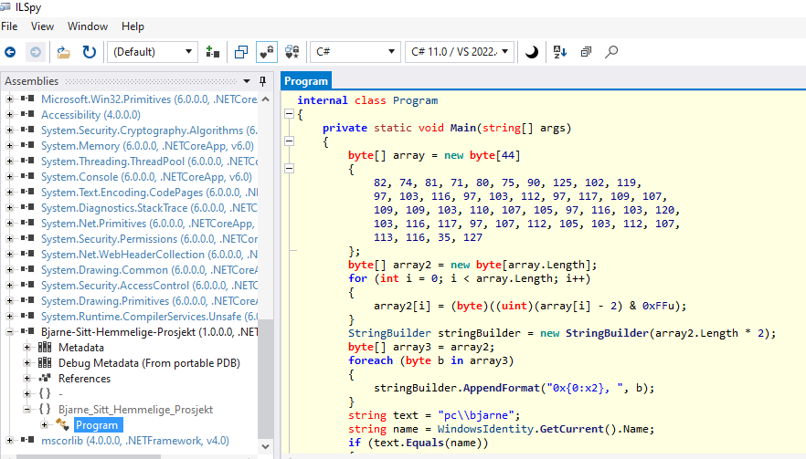

# Sharp Bjarne

Bjarne har laget et program i C# for sitt hemmelige prosjekt, han har lagt til noen sikkerhets fungsjoner som hindrer uatoriserte personer til å kjøre koden. Klarer du å finne det ut for å få flagget? 

# Løsning 

1. Siden vi jobber med en PE, så kan det være fordel i å finne ut av hva vi jobber med.
2. Ved å bruke "strings" på exe filen, så ser vi at .NET Framework 4.7.2
3. siden .NET er morsomt og laget for å fungere på alt av windows, så er det derfor veldig enkelt å hente ut koden. 
4. Ved å bruke ILspy, så kan man enkelt dekopilere exe filen.
5. Man ser enkelt logiken i koden, der man ser at kan gjøre to ting:
    - man kan ta koden ut og fjerne skjekken og dermed kjøre for å få flagget
    - man kan ta stengen og forsøke å dekode den;

flag: PHOENIX{du_er_en_skikkelig_revers_ingenior!}
